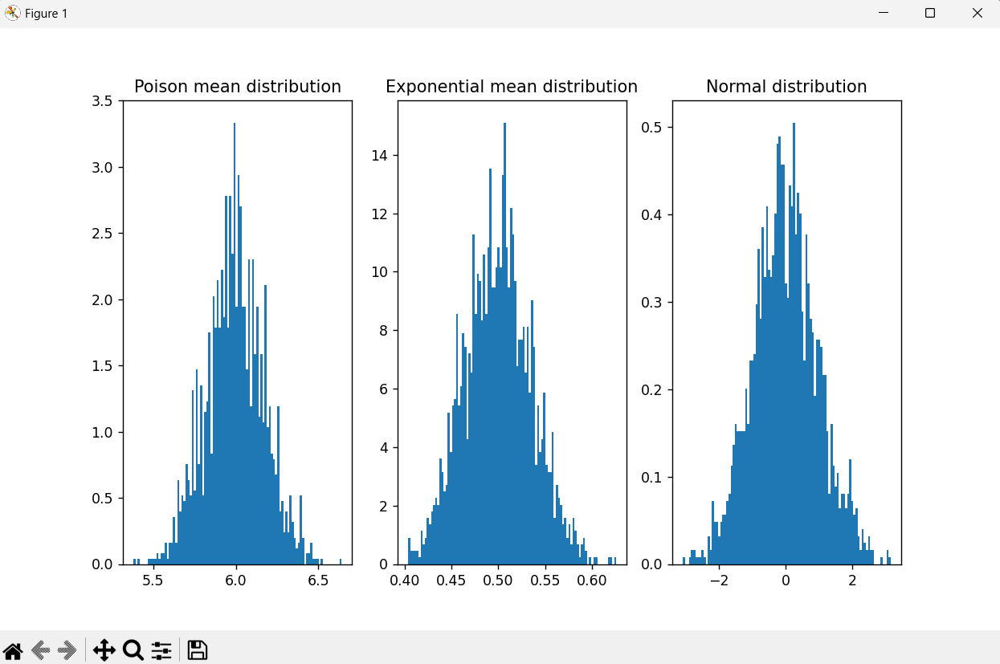

# Розв'язок завдання
## Що знаходиться в репозиторії
В репозиторії знаходиться `main.py` файл, який містить реалізацію перших трьох кроків завдання, а саме:  
1. Сгенеруйте 200 IID*, випадкових змінних, отриманих із розподілу Пуассона з
lambda = 6;
2. Повторіть ту саму симуляцію 2 000 разів і в кожній ітерації підрахуйте середнє
значення цих 200 випадкових змінних;
3. На основі такої вибірки побудуйте гістограму з 2 000 середніх.  

Для запуску проекту треба клонувати репозиторій, встановити необхідні бібліотеки за допомогою команди 
`pip install -r requirements.txt` та запустити `main.py`. 
> У останній версії matplotlib є баг, через який випадає помилка при запуску скрипта з PyCharm. Тому для успішного запуску
треба використати звичайну консоль
  
Після запуску скрипта, на екран виведеться подібне зображення:

Тут ви можете побачити графіки розподілів середніх значень для розподілу Пуассона та експоненційного розподілу. Також
тут представлен графік нормального розподілу для порівняння.

## Властивості розподілу середніх
Відповідно до Центральної Граничної Теореми, розподіл середніх значень, обрахованих на основі 
значень з розподілу Пуасона, буде наближатися до нормального розподілу. (Що ми і бачимо на зображені)
  
Відповідно до цього даний розподіл середніх матиме такі самі властивості як і нормальний розподіл, наприклад:
- семетричність розподілу
- середнє арифметичне, мода та медіана рівні між собою (підтвердження цієї властивості можна побачити у консолі після запуску `main.py`)
- близько 68% значень знаходяться в межах одного стандартного відхилення від середнього, 95% значень - в межах двох 
стандартних відхилень і 99.7% - в межах трьох відхилень

### Характеристика стандартного відхилення, середнього значення та дисперсії у розподілі середніх
Як наслідок Центральної Граничної Теореми стандартне відхилення, середнє значення та дисперсія у розподілі середніх
буде корелювати з відповідними характеристиками початкового розподілу, тобто розподілу Пуассона:
- **стандартне відхилення розподілу середніх** дорівнює стандартному відхиленню
розподілу Пуассона поділеному на корінь з кількості випадкових зміних взятих з розподілу
- **середнє значення розподілу середніх** рівне середньому значенню розподілу Пуассона (За властивістю розподілу Пуасона,
середнє значення розподілу дорівнює lam=6)
- **дисперсія розподілу середніх** дорівнює дисперсії розподілу Пуассона поділеному на кількість значень взятиз з розподілу Пуассона

### Використання експоненційного розподілу замість розподілу Пуассона
При використанні експоненційного розподілу, кінцевий розподіл не матиме значних змін з точки зору властивостей.  
  
Відповідно до Центральної Граничної Теореми отриманий розподіл середніх значень з експоненційного розподілу також буде 
наближатися до нормального розподілу. Тобто попередньо описані властивості будуть справедливі і для поточного розподілу.
  
Відмінність буде у значеннях стандартного відхилення, середнього та дисперсії, оскільки ці значення інші для експоненціного
розподілу з lam=0.5